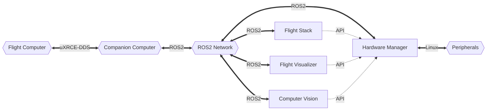

[New here? See the tutorials to get started](./Tutorials/index.md)

UAS Software documentation for multirotor specific repositories.

## Overview

Currently the following projects exist:

- [Computer Vision](./Computer_Vision/index.md)
- [Flight Stack](./Flight_Stack/index.md)
- [Flight Visualizer](./Flight_Visualizer/index.md)
- [Hardware Manager](./Hardware_Manager/index.md)

At a high level they can be viewed like this:

